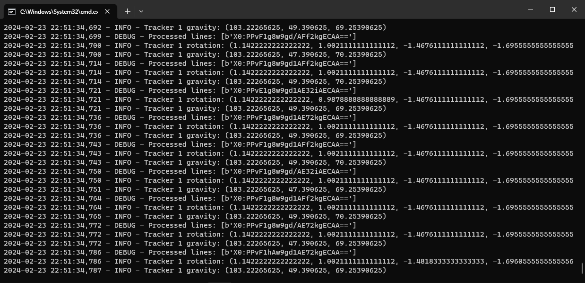
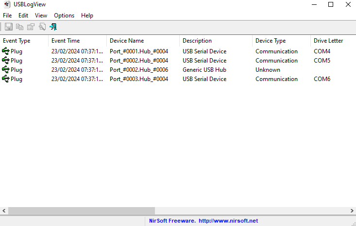

# haritora-gx6-poc
People wanted a way to communicate with the GX6 Communication Dongle for the HaritoraX Wireless trackers, so after a couple days of work here is a proof-of-concept script that does just that! 

## Description
The [SlimeTora](https://github.com/OCSYT/SlimeTora) project allows you to connect the HaritoraX Wireless trackers to the SlimeVR server software, which many people found to be more stable. Unfortunately it only supported Bluetooth with people who use the GX6 Communication Dongle left out.. until now.*

This project allows you to interface with the GX6 Communication Dongle to grab the IMU's tracking data and even detect button presses on the trackers themselves. The script runs a local server which, with the use of software like [RealTerm](https://sourceforge.net/projects/realterm/) to capture and echo the serial data to the server, allows for it to interpret the tracking data for use in software like the [SlimeVR Server](https://github.com/SlimeVR/SlimeVR-Server) and even detect button presses (with how many times they were pressed). **The script rounds the tracking data to 5 decimal places when printing, it is untouched.**

**\* currently still working on implementing it into the project, stay tuned!**

## Features
- Interpret the IMU's tracking data
- Interpret trackers' buttons - detect which button was pressed and how many times
- Get raw ankle tracking IR data (no math yet to be interpreted)
- Get battery info of trackers (when turning on tracker w/ script on)
- Debug mode - print out raw data and print to a log file

## Todo
- Directly communicate with serial ports, instead of relying on software to echo to server
- Add more data - as per [sim1222's project](https://github.com/sim1222/haritorax-slimevr-bridge/blob/master/src/haritora.rs), there is a lot more data I should see if I can grab from the trackers.
- or, request any data from trackers at any time (eg battery) - unsure if possible
- Investigate any unknown labels (eg `o`)
- Interpret calibration data

## GX6 Communication Dongle
<spoiler>The GX6 Communication Dongle is a 2.4GHz dongle that uses a proprietary protocol to communicate with the HaritoraX Wireless trackers to skip bluetooth to be more stable, lower latency, allowing more bluetooth devices, etc.

The dongle works by acting as a `Generic USB Hub` and within it, three `USB Serial Device`s are plugged in. These serial devices communicate with two trackers each (with a total of all 6 trackers split between the three) which allows the [HaritoraConfigurator](https://shop.shiftall.net/en-us/products/haritoraconfigurator-global) software to communicate with the trackers.

When first opening a connection to the serial port, the software reports the dongle's model number, firmware version, and serial number under the `i` label (followed by unknown `o`/`o0`/`o1` values). The dongle is constantly finding its two trackers under the labels `a0` and `a1`, outputting the value of `7f7f7f7f7f7f` for both. After a tracker is connected to a port, the tracker reports its battery status under the `v0` label - battery voltage, percentage remaining, and status. Then, it starts reporting the IMU tracking data under its specific label (`x0` and `x1`) which is encoded in base64. When either the main or sub button is pressed on the tracker, a `r0` label is used which tracks how many times both buttons have been pressed using hexadecimal under the same 12 bits of data (bit 7 for main, bit 10 for sub), up until 15 (which is `f`, and is 0-indexed) to which it resets back to 0.

To set the settings on the tracker, we see `o0` and `o1` being used. It used 14 bits and certain bits are used to represent a setting which are as follows:

- Posture data transfer rate - bit 6
  - 50FPS = 0
  - 100FPS = 1
- Sensor mode - bit 7
  - Mode 1 = 1
  - Mode 2 = 0
- Sensor auto correction - bit 11
  - Accel(erometer) = 1
  - Gyro(scope) = 2
  - Mag(netometer) = 4
    - To calculate the setting, get the number(s) of the sensors you want to use and add them together. (Accel + Mag = 1 + 4 = 5)
- Ankle motion detection - bit 14 (last)
  - Disabled = 0
  - Enabled = 1

Examples for values of each label I found (all mostly for tracker 0, however same thing for tracker 1):
- `i:{"version":"1.0.19","model":"GX6","serial no":"SERIAL"}` - dongle firmware version, model, and serial
- `i0:{"version":"1.0.22","model":"mc3s","serial no":"SERIAL"}` - tracker firmware version, model, and serial
- `o0:00000110107000` - the settings for the tracker. 100fps, sensor mode 1, accel+gyro+mag sensor auto correction, and ankle motion detection disabled
- `o:3050` - unknown, reported after `i`
- `a0:7f7f7f7f7f7f` - searching for/unable to find tracker 0
- `v0:{"battery voltage":4107,"battery remaining":94,"charge status":"Discharging"}` - battery voltage, percentage remaining, and status for tracker 0
- `X0:0Ayb3u7+DzWeBxoDVQMAAA==` - raw IMU tracking data for tracker 0, encoded in base64. The last two bits represent the ankle motion data, `==` means nothing (not an ankle tracker)
- `r0:110060800a00` -  - raw IMU button data for tracker 0 - main button pressed 7 times, sub button pressed 9 times (0-indexed, a = 10 in hex)

Right now o is unknown (some sort of setting in the dongle?) and I believe a0/a1 could also be used to provide calibration data to the software. **Any help is appreciated!**

## Acknowledgements
* [SlimeTora](https://github.com/OCSYT/SlimeTora) - inspiration of project
* [Haritora SlimeVR Bridge](https://github.com/sim1222/haritorax-slimevr-bridge/) - the math for interpreting the tracking data
* [ChatGPT](https://chat.openai.com) - because I'm bad at coding
