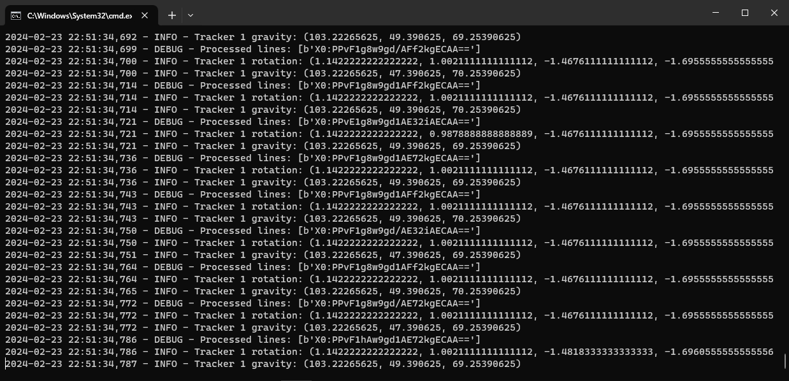
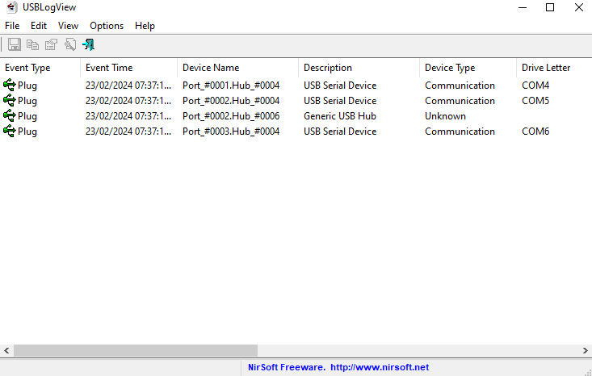

## A new proof-of-concept GitHub repository with updated information for _all_ the HaritoraX trackers will be coming ~~soon~~ at some point?

# haritora-gx-poc

People wanted a way to communicate with the GX6 and GX2 Communication Dongles for the HaritoraX Wireless trackers, so after a couple days of work here is a proof-of-concept script that does just that!

**Check out the [haritorax-interpreter](https://github.com/JovannMC/haritorax-interpreter) NPM package to communicate with any of the HaritoraX trackers!**

## Description

The [SlimeTora](https://github.com/OCSYT/SlimeTora) project allows you to connect the HaritoraX Wireless trackers to the SlimeVR server software, which many people found to be more stable. Unfortunately it only supported Bluetooth at the time, with people who use the GX6/GX2 Communication Dongles left out.. until now.

This project allows you to interface with the GX6 Communication Dongle to grab the IMU's tracking data and even detect button presses on the trackers themselves. The script runs a local server which, with the use of software like [RealTerm](https://sourceforge.net/projects/realterm/) to capture and echo the serial data to the server, allows for it to interpret the tracking data for use in software like the [SlimeVR Server](https://github.com/SlimeVR/SlimeVR-Server) and even detect button presses (with how many times they were pressed). **The script rounds the tracking data to 5 decimal places when printing, it is untouched.**

## Features (of the script)

> [!NOTE]
> This is the features available on this current version of the Python POC script, which currently does not reflect the latest discoveries; see the writeup [below](#gx6-communication-dongle).

- Interpret the IMU's tracking data
- Interpret trackers' buttons - detect which button was pressed and how many times
- Get raw ankle tracking ToF sensor data
- Get battery info of trackers (when turning on tracker w/ script on)
- Debug mode - print out raw data and print to a log file

## Todo

- Directly communicate with serial ports, instead of relying on software to echo to server
- Add more data - as per [sim1222's project](https://github.com/sim1222/haritorax-slimevr-bridge/blob/master/src/haritora.rs), there is a lot more data I should see if I can grab from the trackers.
- or, request any data from trackers at any time (eg battery) - needs more experimenting
  - discovered; see writeup [below](#gx6-communication-dongle).

## GX6 Communication Dongle

The GX6 Communication Dongle is a 2.4GHz dongle that uses the [Gazell](https://docs.nordicsemi.com/bundle/ncs-latest/page/nrf/protocols/gazell/index.html) protocol from Nordic Semiconductor to communicate with the HaritoraX Wireless (which uses the [nRF52832](https://www.nordicsemi.com/Products/nRF52832) SoC) & HaritoraX 2 trackers to skip Bluetooth; it makes the connection more stable, lower latency, allows additional Bluetooth devices, etc.

The dongle works by acting as a `Generic USB Hub` and within it, three `USB Serial Device`s are plugged in. These serial devices communicate with two trackers each (with a total of all 6 trackers split between the three) which allows the [HaritoraConfigurator](https://shop.shiftall.net/en-us/products/haritoraconfigurator-global) & [Shiftall VR Manager](https://store.steampowered.com/app/3060770/Shiftall_VR_Manager/) software to communicate with the trackers.

When first opening a connection to the serial port, the dongle reports its own, and the trackers' model number, firmware version, and serial number under the `i(id)` label followed by the `o(id)` labels for the settings of the trackers and dongle itself. The dongle is constantly finding its two trackers under the `a(id)` labels, outputting the value of `7f7f7f7f7f7f` if it's not found.

After a tracker is connected to a port, the tracker reports its battery status under the `v(id)` label - battery voltage, percentage remaining, and charge status (discharging, charging, or charged). Then, it starts reporting the IMU tracking data under the `x(id)` label which is encoded in base64.

When either the main or sub button is pressed on the tracker (or the tracker turns on/off), a `r(id)` label is used which tracks how many times both buttons have been pressed using hexadecimal under the same 12 bits of data (bit 7 for main, bit 10 for sub), up until 15 (which is `f`, and is 0-indexed) to which it resets back to 0. It also indicates the tracker's power state: if the character at index 0 is `"0"`, or indices 7, 8, 10, or 11 are `"f"`, the tracker is off or turning off. Otherwise, it is on or turning on. Also within the `r(id)` labels is a way to identify the tracker (bit 5), read the table below:

| Tracker name | Bit 5 value |
| ------------ | ----------- |
| Chest        | 1           |
| Left knee    | 2           |
| Left ankle   | 3           |
| Right knee   | 4           |
| Right ankle  | 5           |
| Hip          | 6           |
| Left elbow   | 7           |
| Right elbow  | 8           |
| Left wrist   | 9           |
| Right wrist  | 10          |
| Head         | 11          |
| Left foot    | 12          |
| Right foot   | 13          |

To set the settings on the tracker, we see `o(id)` identifiers being used. It uses 14 bits and certain bits are used to represent a setting which are as follows:

| Setting                    | Bit | Options         | Value |
| -------------------------- | --- | --------------- | ----- |
| Posture data transfer rate | 6   | 50FPS           | 0     |
|                            |     | 100FPS          | 1     |
| Sensor mode                | 7   | Mode 1          | 1     |
|                            |     | Mode 2          | 0     |
| Sensor auto correction     | 11  | Accel(erometer) | 1     |
|                            |     | Gyro(scope)     | 2     |
|                            |     | Mag(netometer)  | 4     |
| Power state                | 13  | On              | 0     |
|                            |     | Off             | 2     |
| Ankle motion detection     | 14  | Disabled        | 0     |
|                            |     | Enabled         | 1     |

To calculate the "sensor auto correction" (aka "dynamic calibration") setting, get the number(s) of the sensors you want to use and add them together - bitwise operations. (Accel + Mag = 1 + 4 = 5)

> [!NOTE]
> When sending commands to the dongle, ensure to wrap the command with linebreaks (e.g. `\r\nv0:\r\n`) to ensure the data is interpreted correctly.

To force the dongle to report either its own or connected trackers last-known statuses/settings, simply sending the label you want to request without any data is sufficient. For example, to request the battery status for tracker 0, send `v0:` to the dongle. This may also act as a heartbeat to ensure the trackers stay connected to the dongle.

To remotely power off a tracker, you can send its settings via the `o(id):` command and change the second-to-last character of the hex string to a `2` (e.g., `00000110107020`).

> [!IMPORTANT]
> The original settings must be sent back immediately afterward to prevent the tracker from getting soft-bricked and turning off repeatedly upon reboot. This can easily be fixed by unplugging the dongle and plugging it back in, or by repeatedly resetting its settings as it powers on & connects.

Examples for values of each label I found (all mostly for tracker 0, however same thing for tracker 1):

- `i:{"version":"1.0.19","model":"GX6","serial no":"SERIAL"}` - dongle firmware version, model, and serial
- `i0:{"version":"1.0.22","model":"mc3s","serial no":"SERIAL"}` - tracker firmware version, model, and serial
- `o0:00000110107000` - the settings for the tracker. 100fps, sensor mode 1, accel+gyro+mag sensor auto correction, and ankle motion detection disabled
- `o:3050` - dongle status. the character at index 2 (`5`) represents the 2.4GHz channel, and the character at index 3 (`0`) represents pairing status (`0` = pairing/unpaired, `1` = paired).
- `a0:7f7f7f7f7f7f` - searching for/unable to find tracker 0 (for that serial port)
- `v0:{"battery voltage":4107,"battery remaining":94,"charge status":"Discharging"}` - battery voltage, percentage remaining, and status for tracker 0 (for that serial port)
- `X0:0Ayb3u7+DzWeBxoDVQMAAA==` - raw IMU tracking data for tracker 0, encoded in base64. The last two bits represent the ankle motion data, `==` means nothing (not an ankle tracker). Bit 20 represents the magnetometer status:
  - HaritoraX Wireless:
    - A = green
    - B = yellow
    - C/D = red
  - HaritoraX 2:
    - Currently unknown
    - HaritoraX 2 has a completely new magnetometer setup, still needs experimenting
- `r0:110060800a00` - raw button data for tracker 0 - main button pressed 7 times, sub button pressed 9 times (0-indexed, a = 10 in hex). Tracker is left ankle (bit 5 = 6, 6 = left ankle)

It is currently unknown what else `a` labels are used for other than reporting seemingly random data every second (though I believe it could be dongle signal info like RSSI when not reporting `7f7f7f7f7f7f`, as Shiftall VR Manager somehow gets that data). **Any help to decode this further is appreciated!**

## Acknowledgements

- [SlimeTora](https://github.com/OCSYT/SlimeTora) - inspiration of project
- [Haritora SlimeVR Bridge](https://github.com/sim1222/haritorax-slimevr-bridge/) - the math for interpreting the tracking data
- [ChatGPT](https://chat.openai.com) - because I'm bad at coding
  - note almost 2 years later: wow you did suck, be glad you didn't end up becoming a modern vibe-coder
